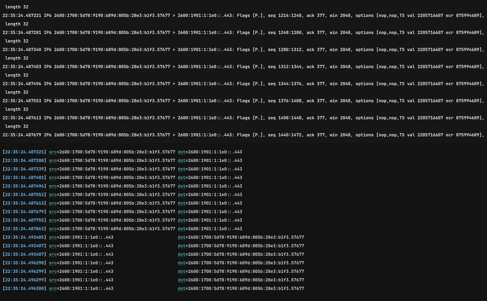

# Grits

`grits` is a minimal, simple, easy-to-use line text-processor that applies regular expressions with named captures to input lines
and transforms them using a custom template string. It allows for efficient parsing, extracting, and formatting of text,
including support for colorization and other attributes you'd get using ANSI escape sequences.

The following example demonstrates how to apply `grits` to `tcpdump` to extract a packet's source IP address:

```bash
sudo tcpdump | grits -p '^(?<ts>[^ ]+)' \
  -p 'IP\w? (?<src>[^ ]+)' \
  -t '[${(cyan|bold):ts}] ${(green|underlined):"src"}=${src || "NOMATCH"}'

```


The left pane in the above screenshot is the raw output of `tcpdump` while the right pane shows the output being piped into `grits`.

## Table of Contents

* [Usage](#usage)
* [Installation](#installation)
* [Templating language](#templating-language)
    - [Indexing](#indexing)
    - [Default values](#default-values)
    - [Attributes](#attributes)
    - [Other examples](#other-examples)
* [Completions](#completions)
* [Contributing](#contributing)
* [Donating](#donating)
* [FAQ](#faq)

## Usage

```
A text line processor that applies regular expressions with named captures to input lines
and transforms them using a user-generated template. See the long help '--help' for further
details and examples.

Usage: grits [OPTIONS] --template <TEMPLATE> [FILES]...

Arguments:
  [FILES]...  Input files

Options:
  -p, --pattern <PATTERN>          A regular expression with named captures. Can be specified multiple times
  -t, --template <TEMPLATE>        A template string that defines how to transform a line input. See long '--help'
      --line-buffered              Force output to be line-buffered.  By default, output is line buffered when stdout is a terminal and block-buffered otherwise
  -c, --completions <COMPLETIONS>  Produce completions for shell and exit [possible values: bash, elvish, fish, powershell, zsh]
  -h, --help                       Print help (see more with '--help')
  -V, --version                    Print version
```

See the long `--help` description for further details and example from the command-line.

## Installation

### crates.io

```bash
cargo install erdtree
```

### cURL

```bash
curl --proto '=https' --tlsv1.2 -LsSf https://github.com/solidiquis/grits/releases/download/v0.1.0/grits-installer.sh | sh
```

### Powershell

```bash
powershell -ExecutionPolicy Bypass -c "irm https://github.com/solidiquis/grits/releases/download/v0.1.0/grits-installer.ps1 | iex"
```

### Manual installation

Check the [releases page](https://github.com/solidiquis/grits/releases) for prebuilt binaries.

## Templating language

`grits` uses a simple templating language to transform text, where templates consist of anchors.
Anchors are placeholders enclosed within `${...}` that correspond to named capture groups from
the regular expression applied to the input. Once a match is found, the value from the
capture group is inserted into the anchor’s position in the template string.

Here's an example:
```bash
echo 'level=info msg=foobar path=/baz' | grit -p 'msg=(?<log>[^ ]+)' -o 'transformed=${log}'
```

In this command, we use a regular expression to capture the value associated with the msg field.
The capture group is named log. The template string `transformed=${log}` will replace `${log}` with
the value captured from the input. The output will then be:

```
transformed=foobar
```

To summarize:
- The regular expression `msg=(?<log>[^ ]+)` captures the value `foobar` into the `log` capture group.
- The template `transformed=${log}` uses the value of `log` to generate the output.

The following are additional features of `grits` templating system:

### Indexing

When there are multiple matches for a given named capture group, you can use **indexing**
to specify which occurrence of the capture to use. The index is placed in square brackets
immediately after the anchor name.  For example, to access the second match of the `log`
capture group, you would use:

```
${log[1]}
```

### Default values

If a particular anchor doesn't have an associated match, default values can be chained using the `||`
operator like so:

```
${log || foo || bar[1] || "NO MATCH"}
```

The first default value that doesn't produce a blank string will be used. Default values can be
other anchors or a string literal.

### Attributes

Attributes offer additional means to transform text. Attributes are applied to anchors like so:

```
${(red|bold):ipaddr_v4}
```

Here is an example using attributes with default values:


```
${(red|bold):ipaddr_v4 || ipaddr_v6 || "NOMATCH"}
```

In the above example, `red` and `bold` will be applied the entire anchor.


The following attributes are currently available:

- `black` (apply a black foreground)
- `red` (apply a red foreground)
- `green` (apply a green foreground)
- `yellow` (apply a yellow foreground)
- `blue` (apply a blue foreground)
- `magenta` (apply a magenta foreground)
- `cyan` (apply a cyan foreground)
- `white` (apply a white foreground)
- `bg_black` (apply a black background)
- `bg_red` (apply a red background)
- `bg_green` (apply a green background)
- `bg_yellow` (apply a yellow background)
- `bg_blue` (apply a blue background)
- `bg_magenta` (apply a magenta background)
- `bg_cyan` (apply a cyan background)
- `bg_white` (apply a white background)
- `bold` (make text bold)
- `underlined` (underline text)
- `reverse` (reverse text)
- `crossed_out` (crossout text)

### Other examples

1. Multi-file processing:

```bash
grits -p 'sysctl=(?<sysctl>.*)'` -p 'sysctl output: ${sysctl}' file1 file2
```

2. Piping:

```bash
docker logs -f 93670ea0964c | grits -p 'log_level=info(?<log>.*)' -o 'INFO LOG: ${log}'
```

3. Attributes, default values, and multiple regular expressions:

```bash
kubectl logs -f -n foo -l app=bar | grits \\
     -p '^kernel:(?<kern>.*)' \\
     -p '^sysctl:(?<sys>.*)' \\
     -o kernel=${(cyan):kern || \"NONE\"} sysctl=${(magenta):sys || \"NONE\"}
```

### Completions

Completions for supported shells can be generated using `grits --completions <SHELl>`. Consult your shell's documentation
for how to setup completions. For `zsh`, completions are bootstrapped like so:

```bash
grits --completions zsh > ~/.oh-my-zsh/completions/_grits
```

## Contributing

All well-intentioned forms of contributions are welcome.

## Donating

If you like this tool, please consider [buying me a coffee](https://buymeacoffee.com/O3nsHqb7A9). Much appreciated!

## FAQ

Q: **Why is this called grits?**
A: I was really craving shrimp & grits while writing this on a plane going to South Korea.
